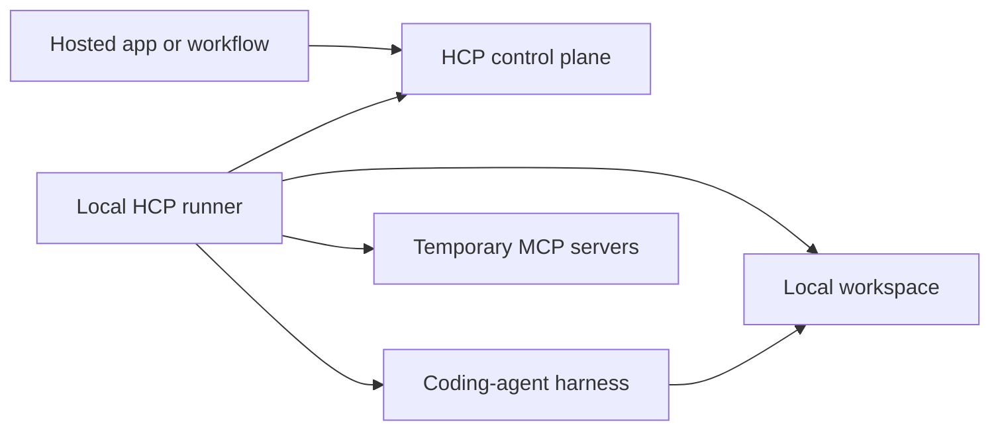

# HCP Runner

[](LICENSE)
[](https://www.typescriptlang.org/)
[](packages/hcp-protocol)

Open-source local runner for the Harness Control Protocol (HCP).

HCP connects hosted apps, workflow systems, and local coding-agent harnesses through an outbound WebSocket connection. The control plane can start sessions, send turns, attach short-lived MCP servers, and receive normalized runtime events without requiring inbound network access to the user's machine.

This repository contains the protocol package, runner implementation, MCP attachment layer, local capability policy engine, mock control plane, and architecture docs needed to build and test HCP integrations.

## Project Status

HCP Runner is an early, pre-1.0 foundation. The protocol and runner core are implemented and covered by tests, but production harness adapters and hosted control-plane integration are still being built.

Implemented today:

- HCP v0 envelopes, message schemas, event types, and parser helpers.
- Runner CLI commands for `version`, `pair`, and `run`.
- Outbound WebSocket lifecycle with hello, accept/reject, heartbeat, reconnect, and capability snapshots.
- Control-plane command handling with ACK/NACK responses and duplicate-command idempotency.
- Session lifecycle events for start, configure, turn, cancel, and stop.
- Local capability leases for filesystem, Git, shell, and dev-server access.
- MCP Streamable HTTP attachment client using the official Model Context Protocol TypeScript SDK.
- Attachment policy for allowed/denied tools, expiry checks, proof-bound requests, redaction, and close-on-session-end.
- Mock control plane for local development and integration testing.

Next major work:

- Production adapters for concrete harnesses such as Codex and Claude Code.
- Real examples for app developers and workflow engines.
- Published packages and release automation.
- Contributor docs, security-reporting process, and compatibility matrix.

## Why HCP Runner Exists

Most hosted automation products need a safe way to use a developer's local environment: source code, Git state, provider credentials, local tools, and running dev servers. Opening inbound ports or copying long-lived credentials into a hosted service is a poor default.

HCP uses a local runner instead:



The runner is the local trust boundary. It advertises what is available, accepts only policy-bound commands, launches local harness sessions, attaches temporary MCP tools, and streams normalized events back to the control plane.

## Repository Layout

| Path | Purpose |
| --- | --- |
| `packages/hcp-protocol` | Public TypeScript types, Zod schemas, HCP message envelopes, and parser helpers. |
| `packages/hcp-runner` | Local runner CLI, connection lifecycle, config loading, session management, MCP attachment client, and local action policies. |
| `apps/mock-control-plane` | Local WebSocket control plane for development, tests, and third-party validation. |
| `docs/architecture.md` | Architecture boundary and MCP SDK responsibility split. |
| `docs/license-decision.md` | Apache-2.0 licensing rationale. |

## Quick Start

Prerequisites:

- Node.js 20 or newer.
- npm 10 or newer.

Clone and validate the project:

```bash
git clone https://github.com/qazisaad/hcp-runner.git
cd hcp-runner
npm install
npm run check
npm test
npm run build
```

Start the mock control plane in one terminal:

```bash
npm run dev:mock -- --host 127.0.0.1 --port 8787
```

Create a local runner config and connect the runner in another terminal:

```bash
npm run dev:runner -- pair http://127.0.0.1:8787 \
  --runner-id local-runner \
  --host-id local-host \
  --out ./runner.local.json

npm run dev:runner -- run --config ./runner.local.json
```

The `pair` command accepts `http`, `https`, `ws`, or `wss` control-plane URLs and writes a runner config with a normalized WebSocket URL.

## Runner Configuration

A runner config describes the local host, allowed workspaces, provider instances, and local capabilities that may be advertised to the control plane.

```json
{
  "runner_id": "local-runner",
  "host_id": "local-host",
  "control_plane_url": "ws://127.0.0.1:8787/",
  "workspaces": [
    {
      "id": "app",
      "path": "/absolute/path/to/workspace",
      "git_remote": "git@github.com:example/app.git"
    }
  ],
  "provider_instances": [
    {
      "id": "codex-local",
      "driver_kind": "codex",
      "display_name": "Codex Local",
      "enabled": true,
      "models": [
        {
          "id": "gpt-5-codex",
          "label": "GPT-5 Codex",
          "is_default": true,
          "capabilities": {
            "option_descriptors": []
          }
        }
      ],
      "local_capabilities": ["filesystem", "git", "shell", "dev_server"]
    }
  ],
  "local_capabilities": [
    {
      "id": "filesystem",
      "status": "available",
      "scopes": ["workspace_read", "workspace_write"],
      "approval_required": false
    },
    {
      "id": "git",
      "status": "available",
      "scopes": ["workspace_read", "workspace_write"],
      "approval_required": false
    },
    {
      "id": "shell",
      "status": "available",
      "scopes": ["workspace"],
      "approval_required": true
    },
    {
      "id": "dev_server",
      "status": "available",
      "scopes": ["workspace"],
      "approval_required": true
    }
  ]
}
```

Provider executable paths, home directories, launch arguments, and persistent environment variables stay in the local runner config. They are not sent to the control plane as part of capability snapshots.

## Protocol Model

HCP messages are JSON envelopes with an id, type, protocol version, timestamp, payload, and optional metadata.

Core message families:

- Host lifecycle: `host.hello`, `host.accepted`, `host.rejected`, `host.heartbeat`, `host.capabilities.updated`.
- Control-plane commands: `harness.session.start`, `harness.turn.send`, `harness.turn.cancel`, `harness.session.stop`, `harness.approval.respond`, `harness.input.respond`, `tool_servers.detach`.
- Command results: `hcp.command.ack`, `hcp.command.nack`.
- Runtime events: `harness.event` with known event types such as `session.started`, `turn.completed`, `mcp_tool.started`, and `local_capability.action.failed`.

The protocol package exposes both TypeScript types and runtime schemas so control planes, runners, and tests can validate the same contract.

## MCP Attachments

HCP can attach temporary MCP servers to a workflow-launched harness session. Runner-side MCP support is intentionally wrapped behind `McpAttachmentClient` so the official SDK handles protocol mechanics while runner-owned policy remains local.

The runner enforces:

- Streamable HTTP transport validation.
- Attachment expiry.
- Proof-bound request headers.
- Allowed and denied tool lists.
- Redaction of headers, arguments, outputs, and errors before logging.
- Event emission for connection, discovery, tool calls, denial, and failure.
- Client close and cleanup when the harness session ends.

## Local Capability Leases

Local capabilities are short-lived grants minted by the control plane and enforced by the runner. A lease is bound to a session, host, provider instance, and workspace.

The runner validates:

- Lease expiry and revocation.
- Session, host, provider, and workspace binding.
- Requested scopes against configured runner capabilities.
- Provider support for each capability.
- Max-call limits.
- Shell command policy including executable allow/deny lists, argument patterns, shell-wrapper permission, timeout, and selected-workspace-only current working directory.
- Workspace containment using real paths so symlink escapes are rejected.

## Development

Useful commands:

| Command | What it does |
| --- | --- |
| `npm run check` | Type-checks every workspace with `tsc -b --pretty false`. |
| `npm test` | Runs all package and app tests. |
| `npm run build` | Builds protocol, runner, and mock control plane packages. |
| `npm run dev:mock -- --port 8787` | Starts the local mock control plane. |
| `npm run dev:runner -- version` | Prints the runner and protocol versions. |
| `npm run dev:runner -- pair <url>` | Generates a runner config for a control-plane URL. |
| `npm run dev:runner -- run --config <path>` | Connects the runner to a control plane. |

The repo uses npm workspaces:

```bash
npm test --workspace @hcp-runner/protocol
npm test --workspace @hcp-runner/runner
npm test --workspace @hcp-runner/mock-control-plane
```

## Security Posture

HCP Runner treats the local machine as the sensitive boundary.

- The runner connects outbound; it does not require inbound network access.
- Provider paths, homes, launch args, and persistent environment remain runner-local.
- Workspaces must be explicitly configured when workspace restrictions are enabled.
- Local actions require leases and are checked again at action time.
- MCP tools are attached per session and closed at session end.
- Tool arguments, outputs, request headers, and errors are redacted before event logging.

This project does not yet include a formal `SECURITY.md`. Until that exists, avoid publishing exploit details in public issues; open a minimal issue requesting a private maintainer contact path.

## Contributing

Contributions are welcome while the project is still taking shape. The most useful contributions right now are small, focused pull requests that improve one of the core contracts:

- Protocol schema clarity and test coverage.
- Runner lifecycle behavior.
- MCP attachment policy and compatibility.
- Local capability lease enforcement.
- Mock control-plane developer experience.
- Architecture docs and examples.

Before opening a larger change, start with an issue describing the use case and the protocol surface it needs.

## License

HCP Runner is licensed under the [Apache License 2.0](LICENSE). The license was chosen because this project is intended to be adopted by applications, companies, and open-source infrastructure while preserving a clear patent grant.
